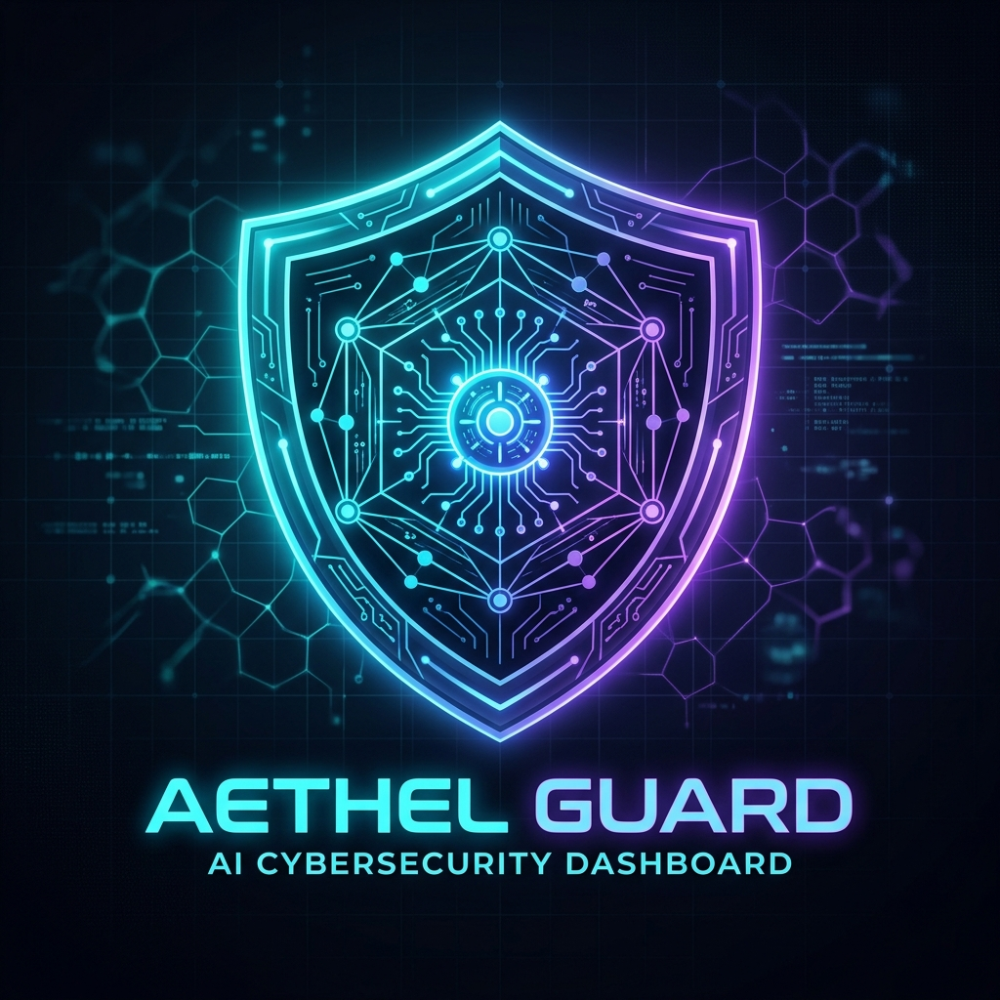

# 🛡️ Vulnix AI - AI-Powered Cybersecurity Platform



Vulnix AI is a next-generation cybersecurity platform that combines traditional vulnerability scanning with advanced Artificial Intelligence. By leveraging high-performance scanning tools and large language models, Vulnix AI provides not just a list of vulnerabilities, but a comprehensive, intelligent analysis and remediation roadmap for your infrastructure.

---

## 🚀 Current Accomplishments

We have successfully built the foundation of a production-grade security platform:

### 1. Scalable Distributed Architecture
- **Express.js Backend**: A robust API layer managing scan requests and user interactions.
- **BullMQ & Redis**: A reliable asynchronous task queue system that handles high-concurrency scanning jobs.
- **Dockerized Workers**: Independent scanner nodes that can be scaled horizontally to handle massive workloads.

### 2. Intelligent Scan Engine
- **Nmap Integration**: Real-time port scanning and service discovery using industry-standard tools.
- **Vulnerability Mapping**: Automated detection of potential security flaws based on scan results.

### 3. AI-Driven Analysis
- **Google Gemini Integration**: Advanced analysis of scan data to identify critical risks and provide human-readable remediation steps.
- **Interactive Security Assistant**: A dedicated AI chat interface to help users understand their security posture.

### 4. Modern Real-time Dashboard
- **React + Vite**: A lightning-fast, responsive frontend interface.
- **Supabase Real-time**: Live updates for scan progress, logs, and vulnerability detection via WebSocket subscriptions.
- **Secure Authentication**: Integrated user management and authentication.

---

## 🎯 Future Roadmap (Targets)

Our goal is to evolve Vulnix AI into the ultimate security companion:

- [ ] **Multi-Tool Integration**: Incorporate OWASP ZAP, Nikto, and Metasploit for 360° coverage.
- [ ] **Automated Remediation**: AI-generated patch suggestions and shell scripts for instant fixes.
- [ ] **Comprehensive Reporting**: Export professional security audits in PDF, JSON, and CSV formats.
- [ ] **Continuous Monitoring**: Scheduled recurring scans with automated alerting (Email/Slack).
- [ ] **Cloud-Native Scanning**: Specialized scanning modules for AWS, Azure, and GCP environments.
- [ ] **Team Collaboration**: Multi-user workspaces with role-based access control (RBAC).

---

## 🛠️ Tech Stack

- **Frontend**: React, Vite, TailwindCSS, Supabase Auth/Realtime
- **Backend**: Node.js, Express.js, TypeScript
- **Task Management**: BullMQ, Redis
- **Security Tools**: Nmap
- **AI/ML**: Google Gemini (1.5 Flash)
- **Infrastructure**: Docker, Docker Compose

---

## ⚙️ Getting Started

### Prerequisites
- Node.js (v18+)
- Docker & Docker Compose
- Redis (Local or Cloud)
- Supabase Project
- Google Gemini API Key

### Installation

1. **Clone the repository**:
   ```bash
   git clone https://github.com/Devi007645/Vulnix-AI.git
   cd vulnix-ai
   ```

2. **Install dependencies**:
   ```bash
   pnpm install
   ```

3. **Configure environment variables**:
   Create a `.env` file in the root and add your keys (see `.env.example`).

4. **Start the services**:
   ```bash
   docker-compose up -d  # Start Redis and Workers
   npm run dev           # Start Frontend
   npm run server        # Start Backend
   ```

---

## 📄 License

This project is licensed under the MIT License - see the [LICENSE](LICENSE) file for details.
